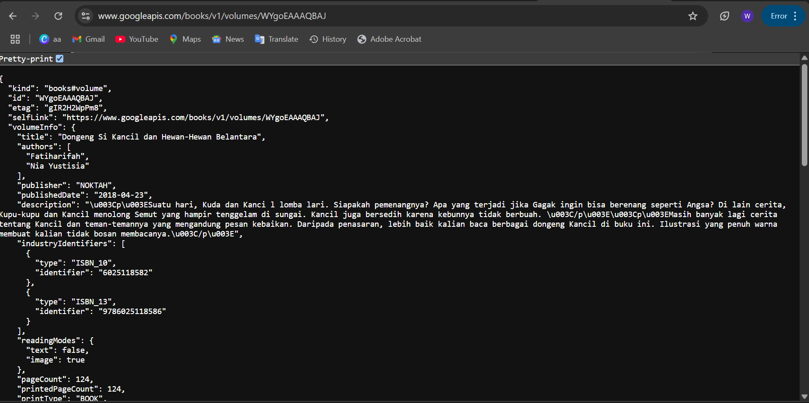
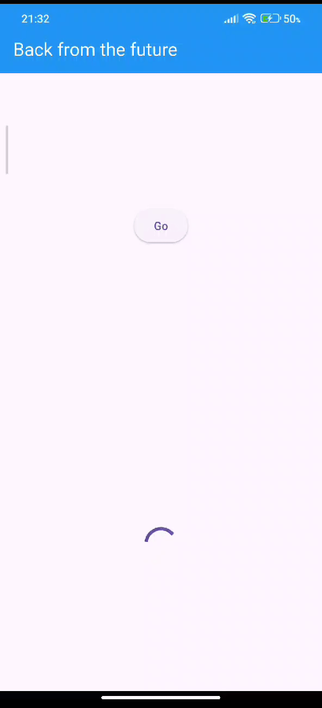
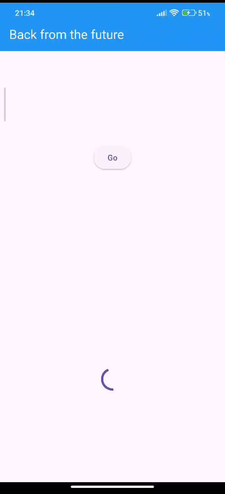
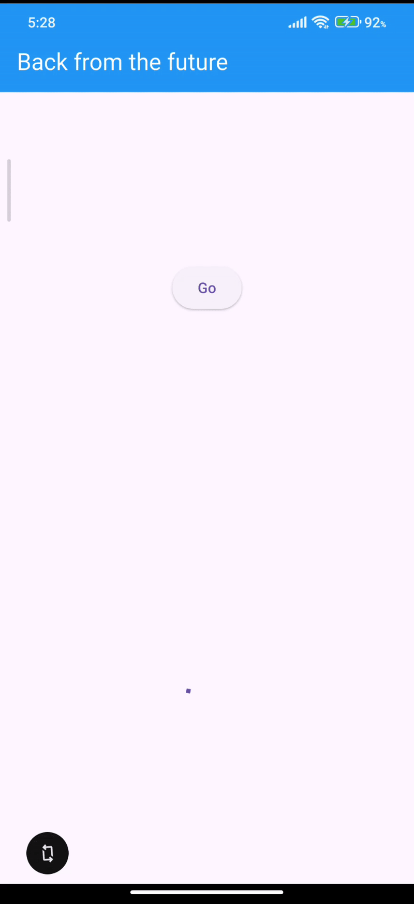
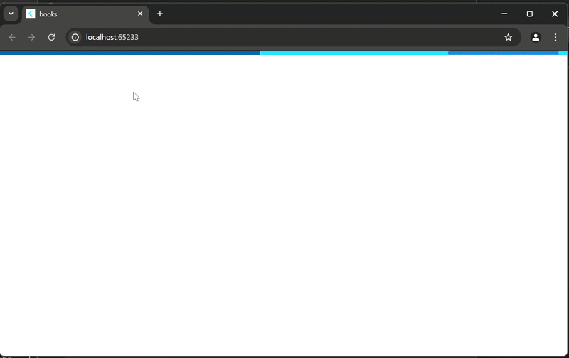
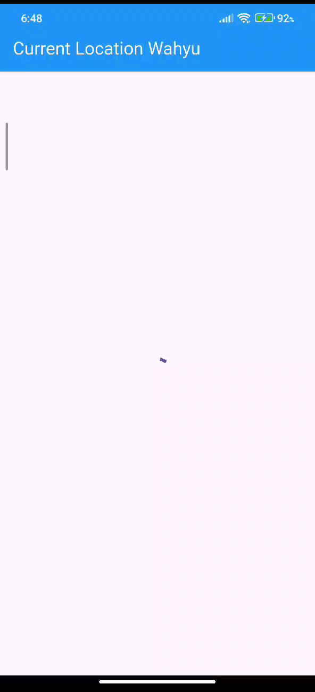
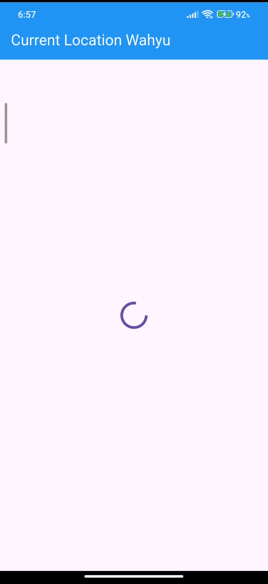
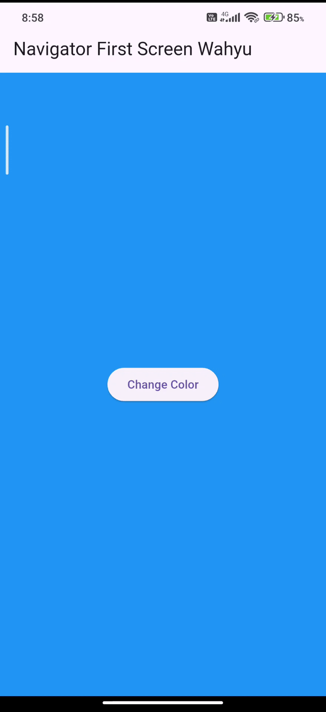
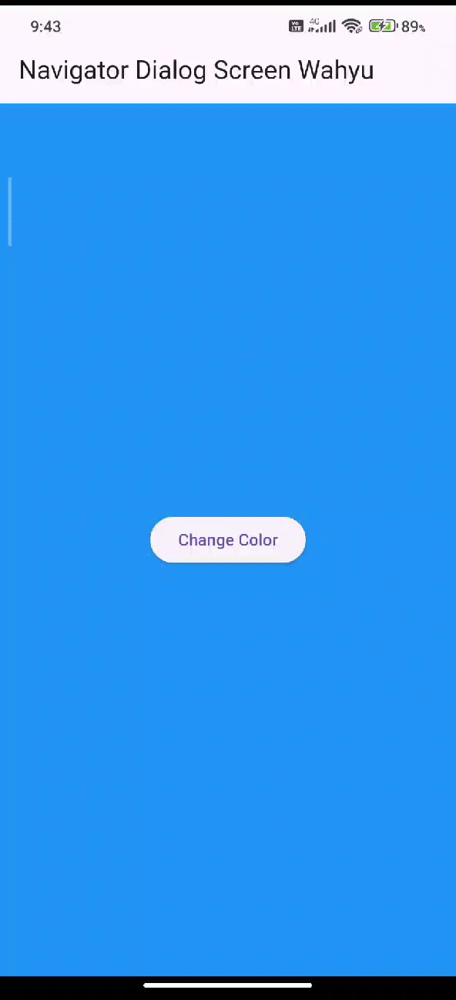

# Books Wahyu Arliansyah

## Soal 2 (Capture JSON)



## Soal 3 (Gif)

### Substring untuk Membatasi Hasil Respon API

Anda dapat menggunakan `substring` untuk membatasi hasil respon API hanya 450 karakter pertama. Ini berguna untuk menjaga tampilan UI agar tetap rapi.

### CatchError untuk Menangani Error

Gunakan `catchError` untuk menangani error yang mungkin terjadi selama proses pengambilan data. Ini akan memperbarui UI dengan pesan error yang sesuai.


## Soal 4

### Langkah 1

Membuat fungsi `asynchronous` yang menunggu setiap 3 detik (`returnOneAsync`, `returnTwoAsync`, dan `returnThreeAsync`) dan mengembalikan nilai integer

### Langkah 2

Memanggil fungsi-fungsi `asynchronous` tersebut secara berurutan, menunggu setiap fungsi selesai, dan menjumlahkan hasilnya.


## Soal 5

`calculate` adalah fungsi asynchronous yang menunggu 5 detik, lalu menyelesaikan Future yang terkait dengan `completer` menggunakan `completer.complete(42)`.



## Soal 6

Perbedaan nya adalah codingan dilangkah ke 2 lebih sederhana namun gampang error, sedangkan dilangkah 5-6 lebih aman dan roubust karena adanya mekanisme penanganan error.



## Soal 7


## Soal 8

Perbedaan nya adalah jika menggunalan `FutureGroup` lebih cocok jika perlu menambahkan `Future` secara dinamis, namun kurang efektif dan gampang error, sedangkan `Future.wait` lebih sederhana, efektif, dan aman.

## Soal 9



## Soal 10

Jika di run hasilnya program akan menjalankan `returnError()` secara asynchronus, misalkan terjadi error UI akan menampilkan pesan error tetapi jika tidak UI akan menampilkan pesan `Success`.
`returnError()` adalah method yang mensimulasikan operasi gagal dengan melempar exception setelah menunggu 2 detik. Sedangkan `handleError()` adalah method untuk menangani error yang mungkin terjadi saat menjalankan `returnError()`, serta memperbarui UI dan menjalankan blok `finally`.

## Soal 11

Menambahkan nama di title

```Dart
title: const Text(
          'Current Location Wahyu',
          style: TextStyle(color: Colors.white),
        ),
```

## Soal 12

Saya mendapatkan koordinat GPS ketika run dibrowser karena browser mendukung `Geolocation API` dan saya sudah memberikan izin lokasi, saya juga run aplikasi di `localhost`, yang diizinkan oleh browser untuk mengakses lokasi walaupun saya menggunakan `HTTP`



## Soal 13

Perebedaan nya kalo kode sebelumnya menggunakan pendekatan manual dengan `then` dan `setState`, yang lebih cocok untuk kasus sederhana tetapi kurang efisien untuk penanganan error dan pembaruan UI. Sedangkan yang sekarang menggunakan `FutureBuilder`, yang lebih bersih, mudah dipahami, dan otomatis menangani pembaruan UI serta error.



## Soal 14

Menambahkan pengecekan `snapshot.hasError` di dalam blok `else if (snapshot.connectionState == ConnectionState.done)` memberikan penanganan error yang lebih baik dan mencegah runtime error.



## Soal 15

Menambahkan nama panggilan di setiap title didalam class NavigatorFirst dan mengganti warna dengan tema Favorit

```Dart
appBar: AppBar(title: const Text('Navigator First Screen Wahyu')),
```

```Dart
Color color = Colors.blue;
```

## Soal 16

1. Ketika Anda mengklik tombol di `NavigationSecond`, screen akan ditutup dan mengembalikan warna yang dipilih ke screen sebelumnya.
2. Screen sebelumnya dapat menggunakan warna tersebut untuk memperbarui UI, seperti mengubah warna latar belakang.
3. Ini adalah pola umum dalam Flutter untuk meneruskan data antar screen menggunakan `Navigator.push` dan `Navigator.pop`.



## Soal 17

1. Ketika klik tombol "Change Color", dialog muncul dengan tiga pilihan warna.
2. Ketika memilih salah satu warna, dialog akan ditutup, dan warna latar belakang screen akan berubah sesuai dengan pilihan Anda.
3. `showDialog` menampilkan dialog dengan pilihan warna.
4. `Navigator.pop` mengembalikan warna yang dipilih ke screen sebelumnya.
5. `setState` memperbarui state dan membangun ulang widget dengan warna baru.

Ganti warna dengan warna favorit

```Dart
Future<void> _showColorDialog(BuildContext context) async {
    final selectedColor = await showDialog<Color>(
      barrierDismissible: false,
      context: context,
      builder: (_) {
        return AlertDialog(
          title: Text('Very Important Dialog'),
          content: Text('Please choose the color'),
          actions: <Widget>[
            TextButton(
              child: Text('Cyan Accent'),
              onPressed: () {
                Navigator.pop(context, Colors.cyanAccent);
              },
            ),
            TextButton(
              child: Text('Yellow'),
              onPressed: () {
                Navigator.pop(context, Colors.yellow);
              },
            ),
            TextButton(
              child: Text('Blue Grey'),
              onPressed: () {
                Navigator.pop(context, Colors.blueGrey);
              },
            ),
          ],
        );
      },
    );

    if (selectedColor != null) {
      setState(() {
        color = selectedColor;
      });
    }
  }
```


